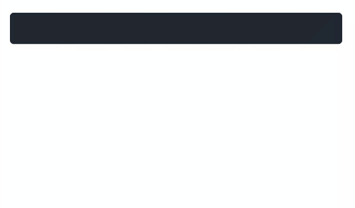

# vue-editable-markdown

> Click to edit textarea with markdown support.



### Install

```shell
npm i vue-editable-markdown
```

### Usage

```javascript
<template>
  <editable-markdown mode="dark" :source="source" v-model="source" @blur="someFunction" />
</template>

<script>
import EditableMarkdown from "vue-editable-markdown"
export default {
  components: {
    EditableMarkdown
  },
  data () {
    return {
      source: "### Example"
    }
  },
  methods: {
    someFunction () {
      console.log("It's worked.")
    }
  }
}
</script>
```

### Features
* Dark/Light mode
* Markdown Support(table,syntax highlighting...)
* GitHub Flavored Markdown Style

### Props

| Prop   	| Options         	| Required 	| Default 	|
|--------	|-----------------	|----------	|---------	|
| mode   	| dark \| light   	| false    	| light   	|
| source 	| markdown string 	| false    	| empty string  |

### Event

@blur : Called when textarea blurred.

### Customization

You can override following classnames for changing components background color and of course you can also use DevTools to find classnames and editing them.

```css
.light.md-text-container {
    background-color: transparent !important; /* your favourite color */
}

.dark.md-text-container {
    background-color: #000 !important;  /* your favourite color */
}
```
